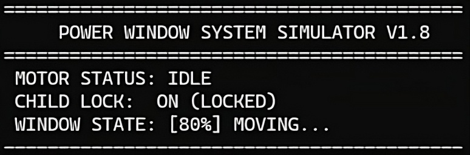

   <!-- TITLE, SUBTITLE AND BRIEF DESCRIPTION --> 
<h2>Automotive Power Window Control System (FSM)</h2>
<h4>Finite State Machine–Based Safety-Critical Simulator in C</h4>
 
   

  

  <!-- ABOUT THE PROJECT -->
## ABOUT
 

    This project is a functional simulation of an automotive power window system, implemented in C and structured around a Finite State Machine (FSM) architecture. The design emphasizes deterministic behavior, safety compliance, and clear state transitions, which are critical characteristics of automotive embedded systems.

Key automotive concepts such as anti-pinch protection, child lock functionality, boundary validation, and event logging are implemented to reflect industry-standard power window controllers (e.g., FMVSS 118 safety principles). Although the system runs as a console application, the logic is directly transferable to microcontroller-based environments.  

 

## INSTALATTION AND EXECUTION
#### REQUIREMENTS
<ol>
   <li>
      
GCC compiler

   </li>
   <li>
      
Windows, Linux, or macOS

   </li>
</ol>

#### STEPS
<ol>
   <li>
      
Clone the repository

<pre><code>git clone https://github.com/hdezj-leslye/power-window-simulator.git
cd power-window-simulator</code></pre>
   </li>
   <li>
      
Compile

      <pre><code>gcc main.c -o window_simr</code></pre>
   </li>
      <li>
      
Run

      <pre><code>./window_sim</code></pre>
   </li>
</ol>

## KNOWN ISSUES AND LIMITATIONS
<li>
   This is a software-only simulation; no real sensors or motors are interfaced.
</li>
<li>
   Timing behavior is simplified and does not use real-time interrupts.
</li>
<li>
   Obstacle detection is manually simulated rather than sensor-driven.
</li>
<li>
   Designed for single-window control (scaling to multiple windows is not yet implemented).
</li>

## LICENSE

Distributed under the Unlicense License. 
See LICENSE for more information.

## CONTACT
